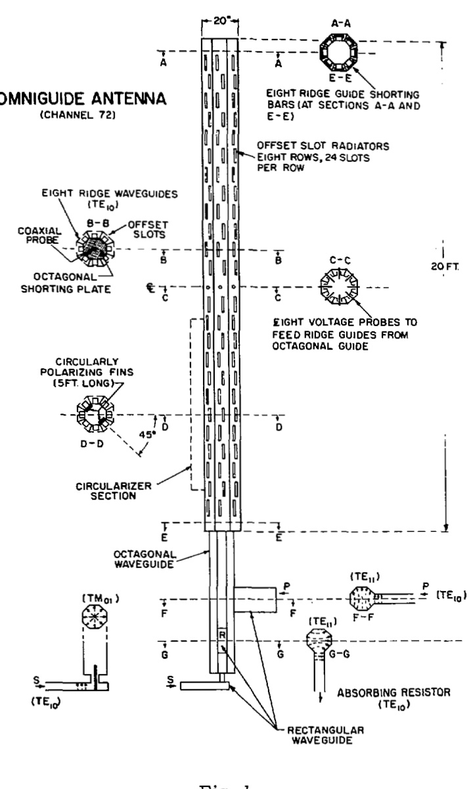
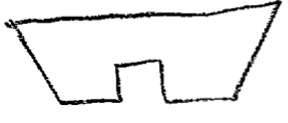
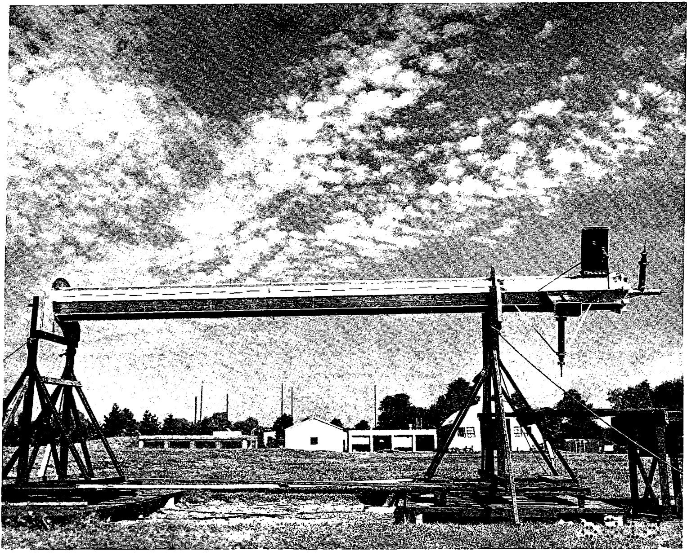

# THEOMNIGUIDEANTENNA; ANOMNIDIRECTIONALWAVEGUIDEARRAYFORUHF-TVBROADCASTING  

O.M.Woodward,Jr.,R.C.A.Laboratories,Princeton,N.J.,and James Gibson,The Royal Institute of Technology，Stockholm,Sweden  

# Summary  

The Omniguideantennais a new typeof high-gain antenna developedfor UHF-Tvbroadcasting.Waveguide components are employed in the design instead of coaxial line elements to increase the power-handling capacity.Separate picture and sound inputs are provided which are decoupled independent of frequency, thus eliminating the need for a frequency-selective combining filter.A reflection-absorbing circuit increases the picture input bandwidth.  

# General Principles of Operation  

Basically,the antenna consists of a circular waveguide assemblywhichconvertsthe energy flowing inside to a radiating.cylindrical current sheet on its outer surface.The circular waveguide permits propagation of the picture and soumd energy as decoupled, symmetrical modes of transmission. In addition, the large diameter of circular waveguide required for this purpose provides a very high power-handling capacity.  

The two required propagation modes are laumched in the circular waveguide by a diplexer joining thetwo separate input lines from the picture and sound transmitters to the circular waveguide base.  

A number of smaller waveguides containing spaced slots as radiators are grouped aroundthecircularwaveguidetofumctionas the radiating, cylindrical surface as well aB the distribution system supplying power from the circular waveguide to the individual slot radiators.Because of the large over-all diameter,eight surrounding waveguides are used to obtain a circular radiation pattern in the azimuthplane.  

# Description  

A diagram of the Omniguide antenna for UHF-TVchannel No.72（818 mc-824 mc）is shown in Fig.l.In this design the mechanical construction was simplified by altering the circular waveguide to an octagonal form and changing the outer rectangular waveguides to a trapezoidal shape.Fach of the trapezoidal waveguides contain&longitudinalridgewhich lowers the cut-off frequency sufficiently to permit propagation of the dominant mode.  

A columm of spaced,vertical slots as horizontally polarized radiators are cut in the outer surfaces ofeach of theeightridge waveguides. The coupling of the slots to the waveguide is controlled by the relative offset positioning of the slots with respect to the center line of the ridge waveguide. The number and spacing of the slots are designed to produce the highly directive elevation pattern required for high power gain.  

Each ridge waveguide is energized at its centerby probeexcitation from the octagonal waveguide,(section C-C),and is terminated at the ends with shorting plungers at sections A-A andE-g。  

The signal from the picture transmitter is fed into the lower end of the octagonal wave= guide as a linearly polarized TE, 11 wavefrom & shunt-connected rectangular waveguide (section F-F). Progressing upward, the wave arrives at a quarter-wave plate or circularizer section. This circularizer consists of two parallel metal fins attached to the inner wall of the octagonal waveguide and lying in a plane making & $\mathbf{45}^{\circ}$ angle with the direction of polarization of the incoming wave (section D-D). The incoming wave may be separated into two linearly polarized waves with equal amplitude and phase, one polarized in the plane through the fins end one perpendicular to this plane. These two components propagate with different phase velocities due to the capacitive loading of the fins. With a proper length of the fins,the two components wiil be in time quadrature as they leave the fin section. Due to the field configuration ofthe $\mathfrak{T E}_{11}$ wave, the components add to produce a circularly polarized wave.  

This wave continues to the voltage probes and energizes the ridge waveguides at their centers with equal power and progressive phasings resulting in essentiallyomnidirectional radiation in the azimuth plane.  

In & reversed procedure, any reflected wave from the radiators is reconverted by the circularizer to a linearly polarized wave polarized at right anglee with respect to the picture input wave. The reflected wave is thus decoupled from the picture input line and is transferred by the diplexer to an absorbing resistor (section G-G).  

Theimpedanceseenbythepictureinput line is therefore independent of the impedance properties of the radiating system.This means a considerable improvement in the picture input bandwidth,secured at a very small sacrifice of picturepowerbeing dissipated inthe absorbing resistor.  

The signal from the sound transmitter, injected through the diplexer base, excites the second higher，or $\mathfrak{M}_{01}$ Mol: mode in the octagonal waveguide.The circufarizer has onlya transformer effect on this mode.Continuing upward, the sound wave energizes the eight ridge waveguides with equal power and equal phase, which also produces essentially omnidirectional radiation in the azimuth plane.  

Thepositionofthetopoctagonalshorting plate and its central probe (section B-B) are provided as separate matching adjustments for thetwo modes。  

Another variation of the Ommiguide antenna constructionconsistsofaddinga coaxial inner conductor to the central,octagonal waveguide.This inner conductor has relatively little effect on the picture mode.The sound energy,however,is fed upward as a TEM mode insteadofthe $\mathfrak{N}_{01}$ mode.Althoughsomewhat more complicated mechanically, the addition of the inner conductor considerably increases the frequencyband over which the central octagonal waveguide can be operated with three independent modes.  

Thephotograph of Fig.2 shows the com= pleted antenna supportedon its side for testing. Thsentire structurewas fabricatedfrom formed aluminum alloy sections spot-welded together. A thin-wall,cylindrical covering of fiberglass material is provided for weather protection. The array weighs approximately 750 pounds,is 20 inches in diameter, and 26 feet high with the lower6feetbeingutilizedforfeedingand mounting.  

High mechanical strength and lowweight aresecuredby the relativelylarge diameter and the cellular form of construction.A single basic structure may be operated over a wide frequencyrangeby theuseofreplaceable slotted panels.  

# Measurements  

Bxperimental measurements showed that the azimuth patterns were circular within ± 0.5 db and that the nominal power gain with respect to a half-weve dipole wes_l3-6 dbi Approximately 40 db of isolation was obtained between theseparate picture andsound inputs. Adeguatebandwidthforboththepictureand soundinputswas obtainedwithless thanO.Oldb power loss in the reflection-absorbing resistor.  

Although the maximum power-handling capacity of the antenna is not known,tests with the limited available power on certain critical components of the system proved that they would safely carry at least the combined powerfroma $27.5\;\mathrm{\bf~km}$ (peak)picture transmitter and a $13.75\;\mathrm{\bfkm}$ soumd transmitter.  

Experimental measurements at higher power levels were not possible due to the lack of a higher power transmitter. However, an analysis of the various elements indicate that this is a very conssrvative figure, and that the antenna will handle much higher powers.  

  
Diagram of the Omniguide antenna.  

  

  

Fig. 2 General view of the Omniguide antenna without the cylindrical, fiberglass covering.  