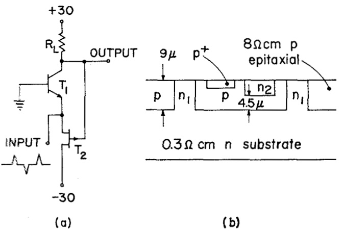
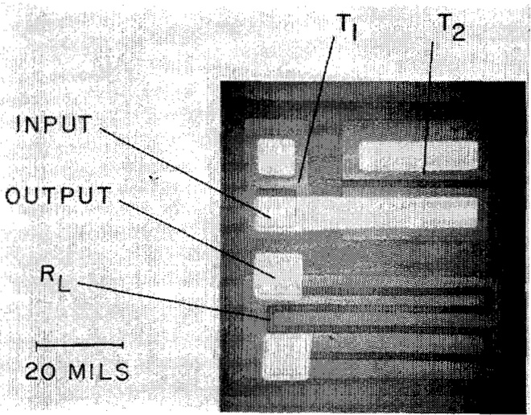
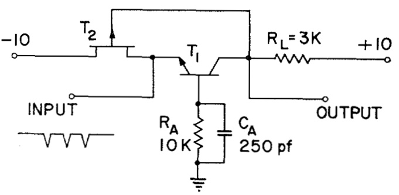
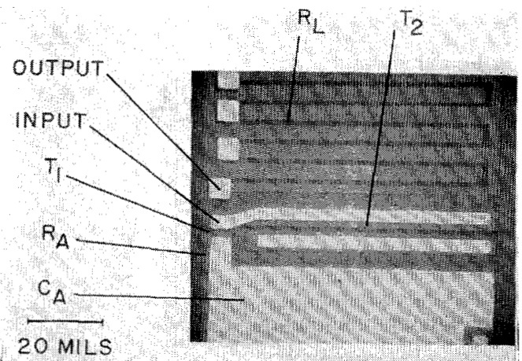

SESSION VIll: Digital Integrated Circuits  

THPM 8.3: A Simple Integrated Realization of a New Bistable Circuits  

D. A. Hodges, D. 0. Pederson and R. S. Pepper  

Electronics Research Lab., University of California  

Berkeley, Calif.  

THIs PAPER will describe an integrated circuit resulting from the application and extension of a recently developedsynthesis procedure for bistablecircuitsi.The synthesisprocedureaimstoobtainoptimumbistable circuits for semiconductor integrated realization.In the synthesis a restriction is made to conventional and fieldeffect transistors as the active devices. Tunnel diodes, unijunction transistors, and avalanche transistors are less compatible in structural and/or processing requirements. Non-electronic effects in semiconductors are not considered.  

Under the foregoing conditions, the synthesis is used todevelop systematically all possible bistable circuits using two active devices. This group is examined to find those circuits best suited for silicon integrated realization,applying the following criteria:  

(a) —Minimum number of isolated devices and regions.   
(b)—Compatible dimensions and impurity concentrations for common regions.   
(c)—Minimum number of processing steps.   
(d)—Noncritical processing techniques.  

The simple bistable circuit illustrated in $(a)$ ofFigure 1, is an example of the results of this technique". This circuit has beenfabricated insiliconintegrated form. Section and plan views are shown in Figures 1(b) and 2. These experimental circuits switch approximately $30\,\mathrm{~v~}$ across the internal load resistance in less than a microsecond. Two have been operated in cascade, demonstrating logic gain. Bistable operation is not critically dependent on supply voltages, trigger characteristics or temperature. With minor modification of this design,it should be possible to obtain circuits operating at different voltage and current levels, and to increase the switching speed.  

The structure shown in Figures 1(b)and 2 was formed using only five photoresist masking steps and three diffusions. It will be noted that the $_{\textrm{n}}$ -type substrate serves simultaneouslyasthecollectorofthetransistor $\pmb{T}_{1}$ and the gate of the field-effect transistor $\boldsymbol{{T}}_{\flat}$ Becausethese elements are common,no isolation of the active devices is necessary and the attendant isolation junction capaci-- tances are avoided. Note also that all but one of the necessary interconnections are formed within the silicon rather than on the surface.  

The $_{\mathrm{p}}$ -type epitaxial layer serves as the base_of $\pmb{T}_{\updownarrow}$ the_channel of $\scriptstyle{T_{:}}$ , and the isolating background for the load resistor. The properties of this region determine junction breakdown voltages, which for the experimental circuits were over $100~\mathrm{~v~}$  

The three diffusions have high surface doping concentrations and are therefore relatively easy to control. The sheet resistance and junction depth of the second $_\mathrm{n}$ -type diffusion $\left(\bf{n}_{2}\right)$ should be_well-controlled; the specifications for the other two diffusions are noncritical. Because no pn junctions are formed by double diffusion, defects due to pinholes and pipes are avoided. Furthermore, bistable"circuits withsimilar characteristics may be obtained for_a considerable range of epitaxial layer thickness and sensitivity simply by adjusting the depth of the second n-type diffusion.For these reasons it should be possible to produce this circuit with a very high yield.  

The bistable circuit (Figure 1 (a) ) can function as a setreset flip-flop when triggered as indicated. The circuit may be modified to have the counting property, i.e., so that trigger pulses of one polarity will cause the circuit to alternate between its two_ stable states. Our most recent synthesis work? shows that one way to obtain the counting property is to include a parallel RC combination in the lead from base to ground; Figure 3. The triggering technique shownis the most satisfactoryof several possibilities.  

The additional resistor and capacitor are included in the integrated structure shown in Figure 4. Experimental circuits of this design have been fabricated and are found to count as predicted. Switching time for this circuit is about 1 μsec; maximum repetition rate is 120 kc. Analysis indicates that by altering dimensions it should be possible to obtain integrated realizations of this circuit which would switch faster.  

In comparison with commercially available integrated bistable circuits, the advantages of this circuit are its simple structure, its relatively nonstringent process control requirements, and its high breakdown voltages. On the negative side, fan-out capability and switching speed appear to be limited in comparison with other bistable integrated circuits.  

One possible application for the circuit proposed is as a combined binary element and Nixietube driver in digital readout_equipment.As indicated it should be possible to build units which would switch the required voltage.  

  
FIGURE1-Atleft $\mathbf{\Pi}(\pmb{a})$ ，the basic bistable circuit.A sectionviewofintegratedrealizationisshownin $\mathbf{\Psi}(b)$ All three diffusion surface concentrations $(n),\,n2,\,p^{+})$ areapproximately ${10^{20}}$ atoms per $\mathbf{cm}^{3}$  

  

FIGURE 2--Plan view of integrated realization of the circuit shown in Figure 1(a). Bright areas are evaporated aluminum.  

  

FIGURE3-Binarycounting circuit.Thecounting operation of this circuit is explainedin reference 3.  

  
FIGU RE 4--Integratedrealization of thebinary counting circuit.Resistance $\pmb{R_{A}}$ isformedinthebulk epitaxial material.Capacitance $c_{A}$ ismetal-oxidesilicon.  