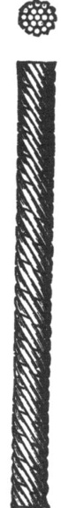
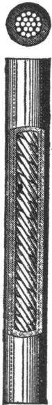
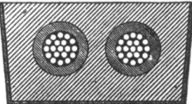
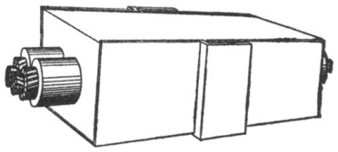
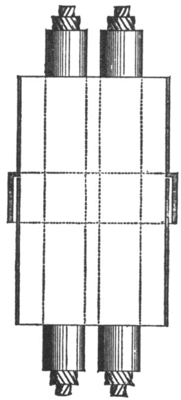

A paper read by Mr W. M. Callender before the American Institute of Electrical Engineers,at Philadelphia, September, $\pmb{\mathrm{1884}}$ ;withdiscussionthereon.  

# UNDERGROUND WIRES.  

The question of underground wires is now one of such universal interest, and one upon which opinions differing as widely as the poles are so freely expressed by.those whom the public consider as its leaders, that I venture to think it may be of importance for this meeting to consider frankly what has already been done toward this end.  

Underground wires may be roughly divided into three kindslighting, telegraph and telephone. That the placing underground of telegraph wires in cities presents no unsurmountable. difficulty, either mechanical or electrical, is acknowledged by all electricians. It is only necessary to refer to what has already been done in Chicago and Washington to prove this practicability. The placing underground of telephone wires is also admitted to be practical, and no doubt many of you have recently had the pleasure of listening to Mr. Berthon, of the Paris Telephone Co., describing how successful has been his underground telephone system in Paris. Mr. Edison proves every day that wires for incandescent lighting can convey their current underground, and work, he claims, satisfactorily, and it is only when we come to the question of “arc" wires that any real difficulty has been experienced. That, however, it is possible to put arc leads underground, there is no room to doubt, and I purpose to point out to you, frst, what are the special points necessary to insure a successful underground arc system, and second, where such a system is in practical use.  

To place wires of any kind underground some sort of a conduit or receptacle is quite necessary, and while a tunnel or sub-way under every street strikes one at once as being the way out of the difficulty, still such a scheme must at once be discarded, in view of its cost, until such a time as the telephone and the electric light are in usc in every household. Until that happy day the underground system, I think, will be somewhat piecemeal. Each telephone, each light and each telegraph company will no doubt try to work its own wires in its own way, to have its wires in its own conduit, allowing no rival to have access to thcm. Admitting this, let us see how this can be worked out. The problem before us is ; suppose all the telegraph and telephone lines underground, how to place the electric light wires so that they will work and not incommode either their telephonic or telegraphic neighbors. A telegraph line is not injuriously affected by an arc circuit, even if in very close proximity, provided, as is always the case, there is a return wire for the arc circuits.A telephone wire is practically useless if in its neighbourhood there is an arc circuit, but if instead of using a single wire for your telephone, you use a metallic circuit, your instrument is in no way affected, and you get satis. factory results. These are, in a word, the conclusions arrived at after a long and thorough investigation into the subject of induction, made by the Gramme Committee last winter—and I think they are pretty generally accepted.  

  
CABLE WITHOUT INSULATION.  

  
CABLE WITH INSULATION.  

When arc lighting was first started here, overhead wires were of course adopted, and it is no doubt largely owing to their cheap construction, that arc lighting has made the wonderful strides it has in this country ; and now that the public are clamoring for the removal of the unsightly poles which disfigure their streets, the companies are loath to sacrifice so much original expenditure, as in so many cases where they have tried an underground system the result has been failure and loss, till now the feelings of the light companies toward the underground question is one of great caution and unbelief. I think all the companies are agreed that, if their wires can be placed underground, it is to their interest to have them there. Their scepticism is not to be wondered at, when we, as practical men, listen to the nostrums so frequently propounded by the many electrical quacks.  

For underground work, the first thing to be decided upon is the conduit. There are many things which influence a decision as to its size and shape, but the following are absolutely necessary.  

If it is under a street, it must be laid solidly, so that it cannot be shifted by the weight of the earth over it, and be strong enough to withstand the pressure and concussion of the traffic. It should be water-tight, and so arranged that the wires can be readily got at, when necessary, either for repairs, or when required tobetapped andabranchline takenfrom them,andabove all it must be cheap.I have before me two sections such as have been successfully used in England, and these I will explain later on. The cheapest conduit which will naturally occur to you is an ordinary cast-iron pipe or a wooden trough, but both of these have their disadvantages.A cable for underground electric cable lighting is necessarily a costly thing, and the old maxim that insulated wire should be treated with respect, and as carefully as a new-born baby, is doubly true in respect to it. Itisbad policy to haul any insulated wire through a pipe. It lays the cableopentodamageandweakeningatthehandsofcareless workmen, and this, where possible, should be avoided. In laying  

  

END VIEW OF CABLES EMBEDDED IN BITUMEN, READY FOR LAYINGIN ROAD.  

a newlineit is therefore advisable tohavethetop ofthe conduit removable, and to lay the cable in it, thus saving any chance of injury. A wooden box does not, in practice, answer so well as iron, and its economy, in England, at least, is little.  

Having settled the question of conduit, the next question which arises is, what is the best conductor to use? The conductor must, of course, be of the purest copper, and it is to be preferred in the form of a strand, rather than as a solid wire.A stranded conductor need cost but a trifle more than a solid wire; it is more easily handled, and thus renders the cable less liable to damage. It presents a larger radiating surface, and is in every way preferable. The insulation of the conductor is of supreme importance, as upon its properties depends the success or failure of the circuit. When a high tension current is used with an E. M. F. of about two thousand volts, everything must be of perfect workmanship.A charge of this magnitude rushing through the wire tests and tries its capacity to the utmost.Any weak place in the insulation is soon found out,and a leak once started,the cable is doomed. The electricity will find its shorter way home, consuming everything in its course. It is, therefore, absolutely necessary that the insulation be such as will withstand a high tension current; that the workmanship be perfect ; and, most important, that the insulation be protected from any danger of mechanical damage.  

  
SECTION OF JOINT.  

The only threeinsulatingmaterialsthatneedbe considered are gutta percha, rubber and its compounds, and bitite or vulcanized bitumen—paraffine and the numerous cotton coverings, although very useful in their own place, are no good for underground, they will neither stand the dampness, nor in fact can they ever be considered as “insulating” a wire.  For you cannot consider a wire insulated, unless when after soaking in a tank of water, and testing by means of a Thomson's galvanometer you get a high insulation resistance.A perfect underground wire should have the followingqualities.  

a. It should be permanent and unchanging. b. It should have an affinity for the earth, and be unaffected by earth acids and changes of temperature. c. It should be cheap, a good insulator and reliable.  

The most famous of all insulators is certainly gutta percha, its tenacious gummy nature adapts it admirably for that purpose, and when under water and unexposed to the atmosphere it is recognized as the standard. The conductors of most submarine cables are insulated with gutta percha, and when electric lighting first became a fact, gutta percha was used in preference to all others.  

  
CABLE AS LAID.  

The objections to its use for underground purposes are, however, grave. While it is under water its life may be very great, but used in the dry it often rapidly deteriorates, the natural gum exudes and leaves only a brittle resin, which soon becomes useless. It is very susceptible to temperature, and cannot be handled with safety in a higher temperature than about $84^{\circ}$ F., and thus, in this climate it is practically useless for underground electric light purposes.  

Vulcanized India rubber (when pure virgin rubber is used) is also a good material, but it is always treacherous and uncertain evenwhenbest,andthetemptationtouseoldandspentrubber, and to doctor it in its vulcanization, is always great—-and soon tells. You cannot make a silk purse from a sow's ear, is a good old proverb. There are many different compounds of rubber, some better, some worse. After all, however, they are simply imitations of pure rubber and seldom equal it. Although both gutta percha and India rubber have long been good servants to electricians, and especially to telegraphists, it has long been felt that some new, cheaperand permanentinsulator was wanted.Bitumen,asthe mostpermanentsubstanceknown,hasbeenafavoritefieldfor chemists and experimentalists. Its chemical composition being so nearly allied to that of pure rubber, seemed to invite experiments, and I hardly know of any electrician of standing, in England at least,whohas not in some way tried to make use of it as an insulator. Failure followed every attempt until Mr. W. O. Callender, of London, England, succeeded some years ago in producing this material “Bitite,”or vulcanized bitumen, in which, by a peculiar secret treatment, he preserves all the lasting properties of bitumen, and adds to it many of the characteristics of rubber. A mineral insulating material is thus produced, which, having an earth as its basis, is perfectly suited for underground, while its low cost invites itsuse.Theoretically,it is the most perfect of all underground insulations, and is accepted as such for all heavy work in England, and there in almost every important installation the main cables are insulated with the Callender Co.'s “Bitite." The House of Commons, Buckingham Palace, the New Law Courts, London, the estate of Lord Salisbury at Hatfield (where there are many miles of underground work) are among the best known installations in England, and in every case the “Bitite" wire in service is underground. It is used by the War Office, Admiralty, Indian Ofice and other departments of Her Majesty's Government, all the leading companies, Brush, Swan, Edison, Pilsen-Joel, Crompton, Maxim-Weston, Rogers, Fife Main and Jablochkoff, and in every case it is recognized as the wire for heavy underground work.  

Naturally every street to be lighted presents special features to be treated specially, and if I describe several of the different systems already laid by the Callender Co., and the plans elaborated by them for the Edison-Swan Co., you will see their practicability and appreciate their simplicity and comparative economy.  

  
PLAN OF CABLE-BoXES, SHOWING FRONT.  

In some cases where it has been found impossible to lay the cable, it has been necessary to draw it through a pipe. At Hatfield several of the cables were drawn through ordinary earthenware drain pipes, and in one installation for the Jablochkoff Co., where about twenty miles of cable were used, it was pulled through iron pipes, and I may mention to show what some people think of insulated wire that in this case it was drawn through by horses. How that wire did escape ruination has always been a subject of wonder.  At Eastbourne, a town about fifty miles from London, lighted by the Brush Co., the wires are nearly all underground and work well. There the wires are drawn through an iron pipe, and a considerable part of them are insulated with “ Bitite." In London itself there is not much permanent arc lighting, and there, where the system of pulling through pipes is not carried out, the following plan has been adopted :  

An iron trough has been laid solidly, and coupled as shown in the sketch, and in this at intervals of about $\mathbf{18^{\prime\prime}}$ are placed bridges, made of insulite, a special preparation of bitumen, and on them the cable is laid. The bridges are inexpensive, and practical men will at once see their advantage in keeping the cables equally distant, and in facilitating their laying. When the cable is laid, pure melted bitumen is run in so as to cement cables, bridges and trough into a solid mass. Care is taken that the heat of the bitumen is not such as to injure the cables, but just suffcient to make a solid imass. The cables once laid upon this plan cannot go wrong, no injury can get at them, and you thus have a permanent piece of work. You may say that such a scheme is faulty, because it does not allow you to increase your number of cables without tearing up the street—although when the gas companies require larger mains, they are obliged to open up the streets. Still our dificulty may be overcome by laying such mains as are required at once, and allowing a free space over them in which the cables might be drawn in if necessary.  The wires can be tapped and connection made easily in something like this way. The lid would be removed and the hard bitumen chipped off till the cable was exposed. A hole would be cut in the side of the conduit and to it would be screwed an ordinary gas pipe, making a water-tight joint, and through this pipe a branch house cable could be brought and joined in the ordinary way to the main cable; replace carefully the insulation and then pour in some more melted bitumen, and the deed is done-—your connection is complete. Substantially, this is the scheine prepared under the instruction from the Edison Swan Co., and while its efficacy is certain, it scost is comparatively low. The main cables at the New Law Courts, London, and the cable for the Brush Co. (arc lights) at Plymouth, as well as many others, are on a modification of this plan, Granted the effciency of this scheme, the question of cost is of next importance. Where there is only one wire to be laid, the cost is, of course, proportionately high.  Where a larger number of leads can be laid, say eight wires (4 circuits) the cost of cable, conduit, bitumen and labor should be decreased to about twenty-five cents per foot per wire. These figures are, of course, only very rough, but are enough to give you an idea of the cost. It must be recognized that.every piece of underground work is a special piece of engineering where special difficulties have to be overcome, and a schene that is in all its details perfect for one place, may not be at all adapted for another, although the cost of each installation need not vary very much. That with such an underground system as I have described, the actual working expenses of a plant will be decreased goes without saying.  The insulation will be more perfect ; failures altogether done away with, no chance of interference owing to weather, and no breaking down of wires, are among a few of the advantages to be reaped from such a system. That the original cost of such a plant would be higher, is also true; but I maintain that true economy is not arrived at by the erection of the cheapest kind of work, but by the erection of some solid, permanent system, in which maintenance does not form one of the chief items, and such a system I have had the honor of laying before you to-day.  

In conclusion, let me frankly state, that what I have advocated should be taken as “principles,”" not so much as “details." And these principles are-1. That to have an underground system for arc lighting, you must have a thoroughly insulated wire, and that such insulation must be able to withstand a high tension current without deterioration, and must be reasonably permanent ; and 2. That the cable must be thoroughly protected from mechanical damage, must be easily got at, and must be easily tapped.  

The scheme I have explained to you is the result of practical experience ; it is not a fancy plan, simply evolved from out the imagination. It has withstood the test of two years’ experience in England, and is to-day as perfect as when laid down, and it is acknowledged to be perfectly successful, and is admitted to be the cheapest scheme known, and, I am confident, will prove equally successfulhere.  

# DISCUSSION.  

THE CHAIRMAN (Mr. W. D. Sargent) : Has any gentleman present any remarks to make on the subject of this paper? I would like very much to hear from Mr. Preece in regard to. underground wires.  

Mr. PrEEcE: Is this a question of arc lighting by means of underground wires?  

THE CHAIRMAN: Outside of that there are persons here who are interested in other underground wires, with which you are very familiar.  

Mr. PreEce: I have been striving very hard during the whole of my stay in this country to prevent being drawn into a discussion of this question of underground wires, and I am bound to confess that my first sensation on hearing the title of Mr. Callender's paper read was to take up my hat and walk, but that would have been an act of discourtesy to the members present, if I had done so; therefore I sat it out, and I have submitted to this very painful ordeal placed upon me by your President to say something on this much vexed question.  

Now, it is not a vexed question in England. The question of aerial wires and underground wires is not a problem to be solved ; it is a problem that has been solved; and whether a wire be put under ground, or whether it be put above ground, is simply a question of pounds, shillings and pence.  As Mr. Callender has said, it is an engineering question, and if any town or village or any landlord wants a wire to be put under ground, he simply has to call in any ordinary English electrician, and he would not be competenttomaintainthetitleofelectricianunlesshewasable to give a clear, impartial and fair estimate of the conditions determined by putting the wire under ground. We know the cost, we know the durability, and we know exactly what to do in any case, whether it was arc lighting, incandescent lighting, telegraphic work or telephonic work.  But I am far from saying that what governs us in England would govern you in the United States. I would not for a moment admit that the experience that we have had with underground wires in England is necessarily the same experience that you ought to have had. You ought to have done this years ago in the United States. But the conditions are totally different.  You have a different climate, and you have different atmospheric conditions, and you work your telegraph in a very different way.  You have a greater distance to go over, and you have both those extremes of heat and cold that we never get in our experience on the other side of the Atlantic Ocean. Hence our experience is not necessarily your experience. But with that experience on that side of the water, I don't think there is an engineer, however competent he may be for designing underground work in England, who is not equally competent to design underground work on this side of the water. Why it is you have delayed the solution of this question with you so long I cannot make out. When I was here, seven years ago, I saw your corporation spending heaps of money in beautifying your streets and in the erection of beautiful buildings, and then allowing them to be disfigured with those hideous posts overhead with wires strung on them. The only advantage that I have yet observed with those overhead wires has been that in hot weather in some place they form very convenient shade. Beyond that I know of no earthly reason why they should be put up. But while you have in this country gone to one extreme, that is in avoiding underground wire altogether, there is a strong tendency somehow to drive you to the other extreme, and that is to force you to put your wires underground. Now, I know the old story about leading the horse to the pond—you cannot make him drink, and I know quite. enough of the American character to know that you cannot force telegraphic companies and telephone companies in this country to go under ground against their will. They must be led up to it gently. It is not ridiculous legislation, and it is not the passing of impractical and absurd measures that will force the wires under ground. It will be a gradual teaching of experience in reference to the working of the companies. I have come in contact, since I came here, with a good many telegraph people. I find they all say, and I am sure they are quite true in what they say, “ Show us a practical underground system and we will adopt it."  Well, I saw several experiments going on, and I can speak from experience of Mr. Callender's system.  All he has said I think is to be recommended. In several instances we have given it a very fair trial on the other side of the Atlantic, and we have tried it faithfully and impartially, as we try every new system that is brought to us, solely on the question of pounds, shillings and pence. And from my own experience I can confirm all he has claimed for his material. We use it in pipes, and we also draw into those pipes copper wires coated with gutta-percha. We are perfectly satisfied with gutta-percha. We know exactly how much to allow for  

We know exactly the durability. All we want now is tohave some substance that will give us the same advantages as the guttapercha at a cheaper price.  At the same time it is a question of pounds, shillings and pence. We know how much it costs us to maintain wires over ground. We know that if we have more than fifteen wires we go under ground, because it is cheaper. That has proved to be the case in England, and we put our wires under ground, because it is cheaper than to go over ground. But there is a serious disadvantage in underground wires, and one which would be felt here more than any other, and that is the retarding effect upon the working of the telegraph with the underground system when it is used. With the insertion of every mile of underground working we have a reduction of the rate of work. On such a circuit as between London and Glasgow it amounts to one word per minute, and in working from London to Glasgow at the rate of two hundred words per minute, if we had ten miles of underground the rate would have to be reduced to one hundred and ninety, so that we find on such a circuit that the insertion of this underground portion retards the rate of working.  

Again with the telephone. I have heard many people say on this side of the Atlantic that you cannot work the telephone under ground. Well, that is simply an absolute mistake. You can work telephones under ground as well as you can work them over ground, but within limits. We have at Newcastle, in England, a very extensive telephone exchange with seven hundred subscribers. Newcastle is a town of over one hundred thousand inhabitants, and the whole of that system is worked with an underground system with no difficulty and no trouble of any sort or kind. But, again, there are limits. This question of static capacity that retards the rate of working all automatic circuits takes off the fine waves of sound that render articulation clear; and as you add mile upon mile of underground circuit, so your articulation diminished until at last you get to the point where articulation for telephonic purposes is practically difficult or impossible. The distance on wires that we use now, or the length of work, is twelve miles.  

Within twelve miles you can work the telephone system on a metallic circuit as effciently under ground as you can over ground.  

Now, I say you have gone to the extreme. You have up to the present moment ignored underground working altogether. But there is danger of your been forced to the other extreme, of being forced under ground, although I do not think you will be so forced. I think the true solution will be as much as possible a matter of expense, as all telegraph companies and telephone companies will learn. They are perfectly willing to use an improved system of underground work. The people themselves would not admit of that destructive policy of cutting down the poles with axe and saw.I am told that in one town not a hundred miles away from Philadelphia, on the first of January, an armed body of men will turn out with axes and saws, and will cut down every telegraphic post in that city. I don't think it is at all likely that. that will be done, for even the thought or idea is suicidal and foolish, and the public would not submit to it for one minute. Therefore on this question what I have to say is, judging from our experience in England, the underground working is as simple as A, B, C, and the more the question is examined, the more these new systems are tried, the more telephone companies will take & little more sense into their councils and try, so as to satisfy the public that they are trying a litle underground working, and the. telegraph companies the same, then the sooner will this question be settled, and the sooner will poor, unfortunate engineers like: myself, who come over here, the sooner we shall be—-I forget the exact words I want to usethe better pleased we shall be in the future to come over here with the hope that in running over for five or six months we shall escape from outside pressure and. obtain needed rest.[Applause.]  